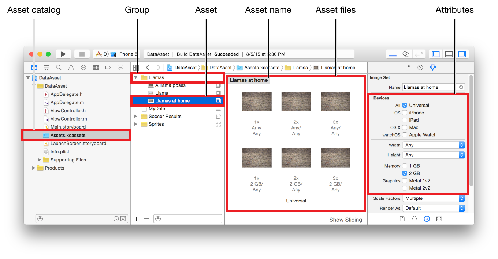
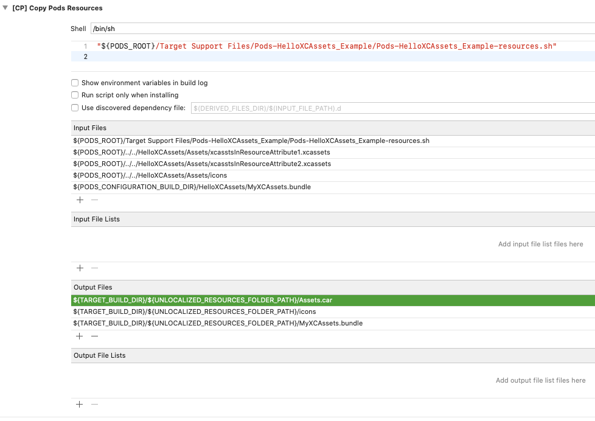

# HelloXCAssets
[TOC]

## 1、Asset Catalog

&nbsp;&nbsp;&nbsp;&nbsp;&nbsp;&nbsp;&nbsp;&nbsp;Asset Catalog是iOS 7推出的管理资源（images、launch images、app icons、colors等）的方式，优点主要如下[^1]

* 支持App thinnig
* 支持简单图片处理而不用使用代码处理，例如rendering mode（图片模板着色）、slicing（图片拉伸）
* 图片名字和资源key不用对应，而且不用手动命名@2x、~ipad、-568等。每种资源都有对应的json文件描述名称（资源key）以及其他属性等
* 支持全局管理资源，某个系统版本或者设备（iPhone or iPad等）缺少相应资源，有编译提示

&nbsp;&nbsp;&nbsp;&nbsp;&nbsp;&nbsp;&nbsp;&nbsp;Asset Catalog通过Xcode来管理，主要是管理一个xcasset文件夹，如下[^2]



>
可以存在多个xcasset文件夹，所有xcasset文件夹都会被Xcode编译打包成一个Asset.car二进制文件。如果要查看这个car文件，可以使用cartool工具解压查看[^3]


## 2、Assets.car文件的位置

&nbsp;&nbsp;&nbsp;&nbsp;&nbsp;&nbsp;&nbsp;&nbsp;xcasset文件夹会被Xcode编译成Assets.car文件，它的文件名是固定的。Assets.car文件可能存在有4种存放方式，如下

```shell
xxx.app
 |- Assets.car (1)
 |- Frameworks
 |   |- HelloXCAssets.framework
 |       |- Assets.car (3)
 |       |- MyXCAssets.bundle
 |           |- Assets.car (4)
 |- main.bundle
     |- Assets.car (2)
```

读取Assets.car中的图片只能通过UIImage的两种API[^4]，如下

* `+ (UIImage *)imageNamed:(NSString *)name;`
* `+ (UIImage *)imageNamed:(NSString *)name inBundle:(NSBundle *)bundle compatibleWithTraitCollection:(UITraitCollection *)traitCollection;`


无法使用指定图片路径的方式来读取图片，例如NSBundle的`- (NSString *)pathForResource:(NSString *)name ofType:(NSString *)ext`

另外，读取Assets.car文件，依赖Info.plist文件，确认同级文件夹下有Info.plist [^5] [^6]


## 3、CocoaPods中使用xcasset文件夹

&nbsp;&nbsp;&nbsp;&nbsp;&nbsp;&nbsp;&nbsp;&nbsp;podspec中可以用`resource_bundles`和`resource`指定，由于xcasset是文件夹，因此指定到文件夹即可，例如"/SomePod/Assets/myImages.xcasset"，后面不需要继续使用通配符。

&nbsp;&nbsp;&nbsp;&nbsp;&nbsp;&nbsp;&nbsp;&nbsp;由于Pod可能会被静态库（.a）或者动态库(.framework)集成，因此`resource_bundles`和`resource`描述的产物在.app中的位置会变化，所以访问资源的代码需要考虑这种情况。

&nbsp;&nbsp;&nbsp;&nbsp;&nbsp;&nbsp;&nbsp;&nbsp;另外，resource_bundles名称和framework同名，对应的Info.plist文件有些字段会冲突，导致读取(3)和(4)只能加载一个。参见HelloXCAssets-Issues工程。


## 4、Asset Catalog使用Tips


https://krakendev.io/blog/4-xcode-asset-catalog-secrets-you-need-to-know

* Template Image使用
* PDF的使用，自动生成@1x/@2x/@3x图片
* 更换Launch Screen.stroyboard
* Image Slicing用法（拉伸图片）


## 5、xcasset图片访问工具类

WCXCAssetsImageTool支持car文件在4种位置的情况，支持代码在main bundle或者CocoaPods（静态库或者动态库）编译。

##### TODO
iOS系统兼容性测试


## 6、Xcode 10+编译Pod中xcassets文件夹的问题

Xcode 10+开始引入New Build System，而且是默认设置。如果podspec文件的描述中，使用s.resource字段并且包含有xcassets文件，夹，则和主工程的xcassets文件有输出的冲突。编译会下面的错误，如下

```
error: Multiple commands produce '/Users/wesley_chen/Library/Developer/Xcode/DerivedData/HelloXCAssets-axqetqlcyzpcqnfcurmdqpssbajb/Build/Products/Debug-iphonesimulator/HelloXCAssets_Example.app/Assets.car':

1) Target 'HelloXCAssets_Example' (project 'HelloXCAssets') has compile command with input '/Users/wesley_chen/GitHub_Projects/HelloCocoaPods/HelloCocoaPods-xcassets/HelloXCAssets/Example/HelloXCAssets/Images.xcassets'

2) That command depends on command in Target 'HelloXCAssets_Example' (project 'HelloXCAssets'): script phase “[CP] Copy Pods Resources”
```

原因在于[CP] Copy Pods Resources中，有Assets.car的输出，如下图，和Xcode的编译存在冲突。



手动删除上面这行可以临时解决，也可以用下面脚本[^7]来删除。

```ruby
post_install do |installer|
  project_path = 'HelloXCAssets.xcodeproj'
  project = Xcodeproj::Project.open(project_path)
  project.targets.each do |target|
      build_phase = target.build_phases.find { |bp| bp.display_name == '[CP] Copy Pods Resources' }
      assets_path = '${TARGET_BUILD_DIR}/${UNLOCALIZED_RESOURCES_FOLDER_PATH}/Assets.car'
      if build_phase.present? && build_phase.output_paths.include?(assets_path) == true
          puts "[Tweak] delete #{assets_path} in phase `#{build_phase.display_name}`"
          build_phase.output_paths.delete(assets_path)
      end
  end
  project.save(project_path)
end
```


References
--
[^1]: https://stackoverflow.com/questions/38117076/asset-catalog-vs-folder-reference-when-to-use-one-or-the-other
[^2]: https://developer.apple.com/library/content/documentation/Xcode/Reference/xcode_ref-Asset_Catalog_Format/index.html#//apple_ref/doc/uid/TP40015170-CH18-SW1
[^3]: https://github.com/steventroughtonsmith/cartool
[^4]: https://stackoverflow.com/questions/32577227/how-to-use-images-asset-catalog-in-cocoapod-library-for-ios
[^5]: http://www.openradar.me/24056523
[^6]: https://github.com/CocoaPods/CocoaPods/issues/4897

[^7]:https://stackoverflow.com/questions/58928768/xcode-new-build-system-cocoapods-copy-pods-resources-has-assets-car-in-output

