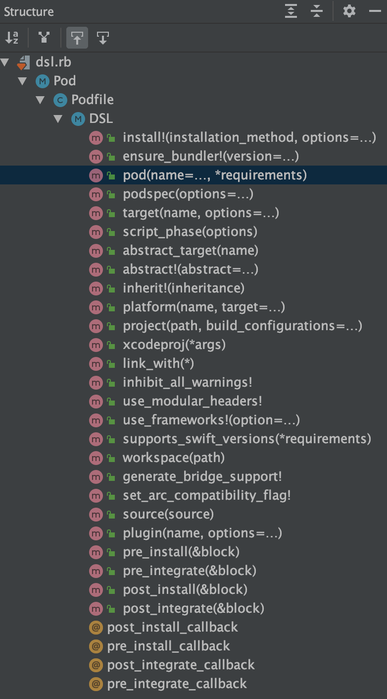
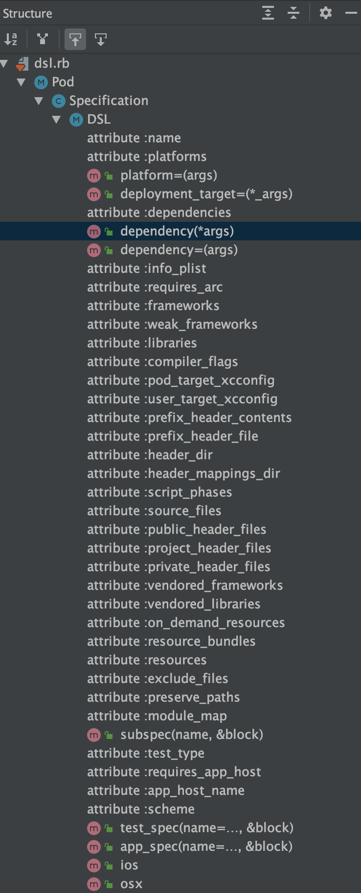
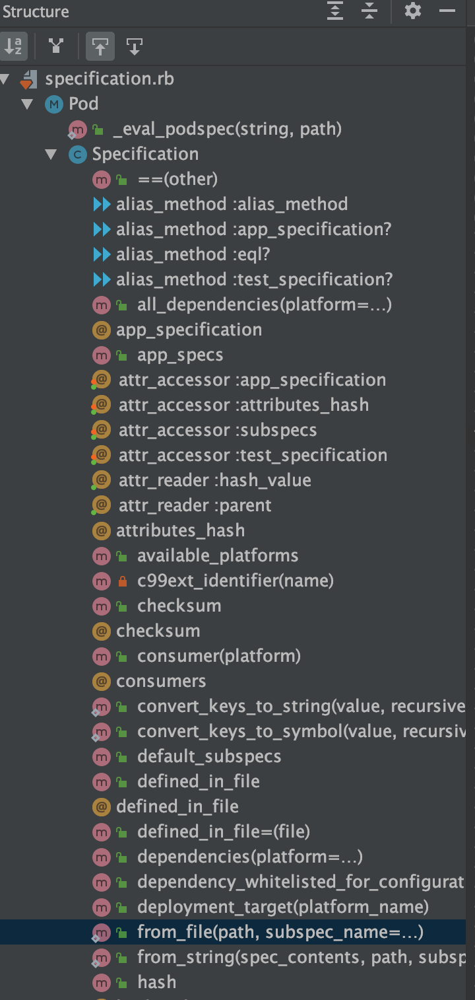

# HelloCocoaPods
[TOC]

## 1、CocoaPods集成原理

### (1) Pod的管理

CocoaPods是一组rubygem，核心的有CocoaPods/CococaPod、CocoaPods/Core、CocoaPods/Xcodeproj

* CocoaPods/CococaPod，属于接口层，用于和用户交互，提供pod命令
* CocoaPods/Core，处理Podfile和podspec
* CocoaPods/Xcodeproj，支持对.xcodeproj和.xcworkspace文件的读写

如果需要观察pod install的详细过程，加上`--verbose`选项

Podfile是Pod使用方可以定制的；而podspec是Pod提供方可以定制的

podspec都缓存在./cocoapods文件夹下，podspec文件描述源码或者二进制文件的位置（remote或者local），一般是指向远端的git仓库的一个commit SHA（branch、tag最终会确定成commit SHA）。读取podspec将源码或者二进制文件缓存在~/Library/Caches/CocoaPods


```shell
$ gem list | grep cocoapods
cocoapods (1.9.3, 1.8.4, 1.7.5)
cocoapods-core (1.9.3, 1.8.4, 1.7.5)
cocoapods-deintegrate (1.0.4)
cocoapods-dependencies (1.3.0)
cocoapods-downloader (1.3.0, 1.2.2)
cocoapods-plugins (1.0.0)
cocoapods-repo-rsync (1.0.6)
cocoapods-search (1.0.0)
cocoapods-stats (1.1.0)
cocoapods-trunk (1.5.0, 1.4.0)
cocoapods-try (1.2.0, 1.1.0)
```


### (2) Pod的编译

* user_target，集成的主target，一般是.app，可以是.framework
* aggregate\_target，挂在user\_target上的一个静态库，源码只有一个dummy文件，主要用于触发它所依赖的所有pod_target去编译以及执行脚本（安装framework、resource_bundle等脚本）
* pod_target，Pod库对应的target


### (3) Podfile的DSL解析

Podfile是一个DSL文件，用于描述Pod的使用者，如何集成Pod。

以CocoaPods1.11.2为例，Podfile的解析代码，位于下面位置

```shell
~/.rvm/gems/ruby-2.6.3/gems/cocoapods-core-1.11.2/lib/cocoapods-core/podfile/dsl.rb
```

这个文件的所有方法都定义在DSL模块中，如下

```ruby
module Pod
  class Podfile
    module DSL
      <many methods>
    end
  end
end
```

其中最常用的pod方法的定义就在这个文件中，如下

```ruby
def pod(name = nil, *requirements)
  unless name
    raise StandardError, 'A dependency requires a name.'
  end

  current_target_definition.store_pod(name, *requirements)
end
```

target方法的定义，如下

```ruby
def target(name, options = nil)
  if options
    raise Informative, "Unsupported options `#{options}` for " \
      "target `#{name}`."
  end

  parent = current_target_definition
  definition = TargetDefinition.new(name, parent)
  self.current_target_definition = definition
  yield if block_given?
ensure
  self.current_target_definition = parent
end
```

另外，CocoaPods提供几个hook方法，最常见的是post_install方法。它的定义，如下

```ruby
def post_install(&block)
  raise Informative, 'Specifying multiple `post_install` hooks is unsupported.' if @post_install_callback
  @post_install_callback = block
end
```

说明

> ~/.rvm/gems/ruby-2.6.3/gems/cocoapods-core-1.11.2/lib/cocoapods-core/podfile/dsl.rb，这个文件提供很详细的注释，以便正常使用这些方法。


#### a. Podfile的方法列表

Podfile的方法列表，如下




### (4) podspec的DSL解析

和Podfile一样，podspec也是一个DSL文件。

以CocoaPods1.11.2为例，Podfile的解析代码，位于下面位置

```shell
~/.rvm/gems/ruby-2.6.3/gems/cocoapods-core-1.11.2/lib/cocoapods-core/specification/dsl.rb
```

这个文件的所有方法都定义在DSL模块中，如下

```ruby
module Pod
  class Specification
    module DSL
      <many methods>
    end
  end
end
```

在了解上面这个文件之前，看看podspec文件的结构，如下

```ruby
Pod::Spec.new do |s|  
  s.name             = 'PodfileScript'
  s.version          = '0.1.0'
  s.summary          = 'A short description of PodfileScript.'

# This description is used to generate tags and improve search results.
#   * Think: What does it do? Why did you write it? What is the focus?
#   * Try to keep it short, snappy and to the point.
#   * Write the description between the DESC delimiters below.
#   * Finally, don't worry about the indent, CocoaPods strips it!

  s.description      = <<-DESC
TODO: Add long description of the pod here.
                       DESC

  s.homepage         = 'https://github.com/wesley_chen/PodfileScript'
  # s.screenshots     = 'www.example.com/screenshots_1', 'www.example.com/screenshots_2'
  s.license          = { :type => 'MIT', :file => 'LICENSE' }
  s.author           = { 'wesley_chen' => 'wesleychen.cl@alibaba-inc.com' }
  s.source           = { :git => 'https://github.com/wesley_chen/PodfileScript.git', :tag => s.version.to_s }
  # s.social_media_url = 'https://twitter.com/<TWITTER_USERNAME>'

  s.ios.deployment_target = '9.0'

  s.source_files = 'PodfileScript/Classes/**/*'
  
  # s.resource_bundles = {
  #   'PodfileScript' => ['PodfileScript/Assets/*.png']
  # }

  # s.public_header_files = 'Pod/Classes/**/*.h'
  # s.frameworks = 'UIKit', 'MapKit'
  # s.dependency 'AFNetworking', '~> 2.3'
end
```

这里Pod::Spec，实际上是Pod::Specification。Spec是Specification的别名[^5]，它定义在~/.rvm/gems/ruby-2.6.3/gems/cocoapods-core-1.11.2/lib/cocoapods-core.rb文件中，如下

```ruby
module Pod
  ...
  # TODO: Fix
  #
  Spec = Specification
end
```

了解Pod::Spec这个类名之后，podspec采用一个特殊的初始化方法，即

```ruby
Pod::Spec.new do |s|  
  ...
end
```

new方法带一个block，在Ruby的语法中默认不支持这种形式，但是重定义**initialize**方法，让它支持一个block参数[^6]，那么就可以实现这种方式。简单来说，定义initialize方法，如下

```ruby
class Foo
  attr_accessor :bar, :baz
  def initialize
    yield self
  end
end

Foo.new do |f|
  f.bar = 123
  f.baz = 456
end
```

实际上podspec也是采用这种方式作为DSL描述。这里不用多说，Pod::Spec.new的block参数s，是Specification对象，而且block体中都是对Specification对象赋值，以及调用Specification对象的特定方法。


#### a. Specification类

在上面已经看到Specification类的定义在下面位置

```
~/.rvm/gems/ruby-2.6.3/gems/cocoapods-core-1.11.2/lib/cocoapods-core/specification/dsl.rb
```

但是这里并不是Specification类的全部，在下面位置也定义Specification类的一些方法。

```shell
~/.rvm/gems/ruby-2.6.3/gems/cocoapods-core-1.11.2/lib/cocoapods-core/specification.rb
```

这里解释下这两个文件的区别。在dsl.rb侧重解析podspec文件（包括dependency方法等定义，提供方法用于podspec中使用），而specification.rb侧重处理执行podspec文件（包括from_file方法等）

dsl.rb提供的方法（部分），如下




specification.rb提供的方法（部分），如下




## 2、podspec语法

老版本的[podspec手册](https://guides.cocoapods.org/syntax/podspec.html)中，有s.xcconfig属性，现在换成s.user\_target\_xcconfig和s.pod\_target\_xcconfig

* s.user\_target\_xcconfig，用于设置user\_target和aggregate\_target
* s.pod\_target\_xcconfig，用于设置pod\_target
* s.xcconfig，相当于同时设置s.user\_target\_xcconfig和s.pod\_target\_xcconfig

> 注意：s.xcconfig设置的属性不能和s.user\_target\_xcconfig、s.pod\_target\_xcconfig重复，否则属性会重复两遍在user\_target或者pod\_target中


### (1) 常见podspec配置

禁用Documentation Issue类型的warning，如下

```ruby
s.pod_target_xcconfig = { 'CLANG_WARN_DOCUMENTATION_COMMENTS' => 'NO' }
```

说明

> 设置`inhibit_all_warnings!`或者`pod 'xxx', :inhibit_warnings => true`，也可以禁用Documentation Issue类型的warning[^7]


### (2) 常见podspec问题

#### a. resources在指定subspec方式的pod时不会生效

举个例子，如下

```ruby
s.default_subspecs = 'Pod_Core', 'Pod_Extra'
s.resources = [
  'SomePod/Assets/*.bundle',
  'SomePod/Assets/*.xcassets',
  'SomePod/Classes/**/*.xib',
]

s.subspec 'Pod_Core' do |ss|
  ss.source_files  = 'SomePod/Classes/Core/**/*.{h,m}'
end

s.subspec 'Pod_Extra' do |ss|
  ss.dependency 'SomePod/Pod_Core'
  ss.source_files  = 'SomePod/Classes/Extra/**/*.{h,m}'
end
```

SomePod有两个subspec，分别是Pod_Core和Pod_Extra。如果只引用pod 'SomePod/Pod_Core'，则s.resources对应的资源并不会加载。

解决方法，如下

```ruby
s.default_subspecs = 'Pod_Core', 'Pod_Extra'

s.subspec 'Pod_Core' do |ss|
  ss.source_files  = 'SomePod/Classes/Core/**/*.{h,m}'
  ss.resources = [
    'SomePod/Assets/*.bundle',
    'SomePod/Assets/*.xcassets',
    'SomePod/Classes/**/*.xib',
	]
end

s.subspec 'Pod_Extra' do |ss|
  ss.dependency 'SomePod/Pod_Core'
  ss.source_files  = 'SomePod/Classes/Extra/**/*.{h,m}'
end
```

如果有subspec，则resources也需要放在对应subspec的下面。


## 3、Podfile语法


```ruby
install! 'cocoapods', :deterministic_uuids => false
```


## 4、pod install vs. pod update[^1]

​       pod使用Podfile和Podfile.lock对pod进行版本管理，确保这个两个文件都在版本控制中（under version control）。官方给出pod install和pod update的区别，这里归纳如下

| pod install                                                | pod update                                |
| :--------------------------------------------------------- | ----------------------------------------- |
| 对pod增加、删除使用pod install                             | 对单个或者全部pod进行更新，使用pod update |
| 新手接触工程（有Podfile和Podfile.lock），使用pod install   | /                                         |
| 初始化工程（有Podfile，没有Podfile.lock），使用pod install | /                                         |


## 5、Pods文件是否需要版本控制[^2]

官方给出的回答是取决于使用者，即可以加入版本控制，也可以不使用版本控制。

> Whether or not you check in your `Pods` folder is up to you, as workflows vary from project to project. 


官方也给出两种方式的好处，如下

| checking in the Pods directory                               | ignoring the Pods directory                                  |
| ------------------------------------------------------------ | ------------------------------------------------------------ |
| clone之后，工程可以立即运行。不需要pod install以及网络连接（⭑） | 仓库占较少的磁盘空间（⭑）                                    |
| Pods下面的代码和库总是可用的，即使其中一个pod的下载链接挂掉了 | 只要pod可以下载，Pods文件夹都创建一模一样的                  |
| clone之后，Pods文件夹和原始安装后Pods文件夹是一模一样的      | Pods文件夹下面没有版本冲突和合并，例如不同pod版本的冲突（⭑） |

说明

> ⭑标记的是个人实践过程，觉得比较明显的好处。


## 6、执行pod命令常见报错

### (1) Unable to determine Swift version for the following pod[^3]

```shell
[!] Unable to determine Swift version for the following pods:

- `HexColors` does not specify a Swift version and none of the targets (`FaveoHelpdeskPro_ObjC`) integrating it have the `SWIFT_VERSION` attribute set. Please contact the author or set the `SWIFT_VERSION` attribute in at least one of the targets that integrate this pod.
```


* 原因分析

某个Pod库的podspec没有指定SWIFT_VERSION，而工程target也没有指定SWIFT_VERSION


* 解法方法

在对应target添加Dummy.swift文件。默认是Swift的最高版本，如果有需要，指定SWIFT_VERSION的版本


### (2) "target has transitive dependencies that include static binaries"[^4]

```shell
[!] The 'Pods-PodfileScript_Example' target has transitive dependencies that include statically linked binaries: (/Users/wesley_chen/GitHub_Projects/HelloCocoaPods/HelloCocoaPods-PodfileSyntax/PodfileScript/Example/Pods/Masonry/Masonry.framework)
```


* 原因分析

Pods-PodfileScript_Example这个target（由CocoaPods生成）是一个动态库，而动态库实际上是不能依赖一个静态库的，因此报错提示这个target有一个间接依赖链接到静态库Masonry。


* 解决方法

有两种方式：如果Podfile中指定了`use_frameworks!`，则Podfile依赖pod库都应该是动态库。这时需要将Masonry换成动态库的版本。

如果Masonry是静态库，则检查Podfile，并将`use_frameworks!`注释掉


// TODO

https://medium.com/@aliakhtar_16369/distribute-framework-using-private-cocoapods-a8beac16617d


```shell
$ pod repo add my_podspec_repo https://github.com/daydreamboy/podspec.git
Cloning spec repo `my_podspec_repo` from `https://github.com/daydreamboy/podspec.git`
$ pod repo list
...
my_podspec_repo
- Type: git (master)
- URL:  https://github.com/daydreamboy/podspec.git
- Path: /Users/wesley_chen/.cocoapods/repos/my_podspec_repo
...
```


## 7、PodfileTool

PodfileTool类是用于Podfile中的一个工具类，用于减少对Podfile侵入业务代码。

PodfileTool支持的feature，如下

* 修改user project的xcconfig，HEADER_SEARCH_PATHS等

* 修改pod project的build setting
* 支持自定义文件覆盖Pods文件夹下面的任意资源文件
* 支持hook pod方法，用于根据配置文件来切换源码依赖模式和二进制依赖模式

> 脚本见HelloRuby/ruby_tool/podfile_tool.rb


用法示例，如下

```ruby
require '~/GitHub_Projects/HelloRuby/ruby_tool/podfile_tool.rb'

# Feature: hook for pod
PodfileTool.do_pod_hook(nil, true)

post_install do |installer|
  # Feature: change xcconfig of user's xcodeproj
  PodfileTool.modify_xcconfig_attrs!(__FILE__, {
    'HEADER_SEARCH_PATHS' => {
      ...
    },
  }, ["PodfileScript_Example"], false)

  # Feature: Copy resource files
  PodfileTool.resource_copy(__FILE__, nil, './copy_map.json', false)

  # Feature: change build setting of Pods.xcodeproj
  PodfileTool.modify_pods_project_build_settings_from_installer!(installer, {
    'APPLICATION_EXTENSION_API_ONLY' => 'NO',
  }, ['PodfileScript'], false)
end
```

> Podfile见PodfileScript工程


## 8、常用路径

~/.cocoapods/repos

~/Library/Caches/CocoaPods/Pods


TODO


## References

[^1]:https://guides.cocoapods.org/using/pod-install-vs-update.html
[^2]:https://guides.cocoapods.org/using/using-cocoapods.html#should-i-check-the-pods-directory-into-source-control

[^3]:https://stackoverflow.com/questions/58691345/unable-to-determine-swift-version-for-the-following-pod-error

[^4]:https://stackoverflow.com/questions/42611599/cocoapods-target-has-transitive-dependencies-that-include-static-binaries
[^5]:https://stackoverflow.com/questions/21244375/class-name-aliases-in-ruby
[^6]:https://stackoverflow.com/questions/34065817/initialize-an-object-with-a-block

[^7]:https://stackoverflow.com/a/27903042


